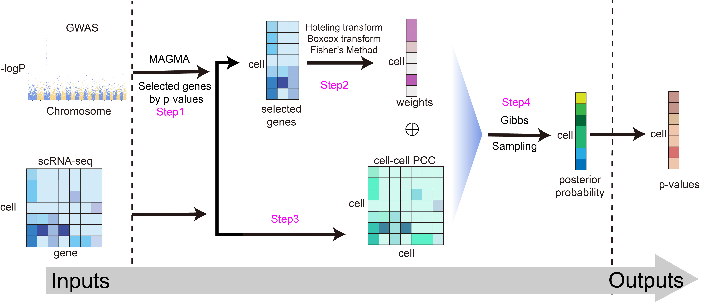

# iscTG: integrate single cell Transcriptome and Genome-wide association studies

iscTG is a comprehensive workflow designed to integrate single-cell transcriptome data with genome-wide association studies (GWAS) to uncover the genetic basis of complex traits at the cellular level. This repository provides a set of tools and scripts to facilitate this integration, along with a workflow to guide users through the process.

## Workflow

The iscTG workflow is designed to streamline the integration of single-cell RNA-seq data with GWAS summary statistics. The key steps include:

1. **Data Preparation**: Ensure single-cell RNA-seq data is in Seurat format and GWAS summary statistics are properly formatted.
2. **Feature Extraction**: Use `extra_features.R` to extract relevant features from gene expression matrices and MAGMA output files.
3. **Testing**: Use `test.R` to run a quick test of the workflow using the provided `mono500.rds` dataset.
4. **Visualization**: Use `out_fig.R` to visualize the results in the form of heatmaps or other relevant plots.
## Main steps

### net61.R
To get PCC net

### 61hbf2k.R
To compute post-probability and p-gamma by PCC net, gene expression matrix and weight from MAGMA

### freq61_type_transfer.R
To attach cell type to results from raw data.

### celltype_heat.R
To visualize results.
## Tips

Because gene expression datasets come in many different formats, users are expected to preprocess their own data and merge the gene expression values with MAGMA results into a single matrix. The first 2,000 columns should contain normalized gene expression values, and the remaining 2,000 columns should contain the corresponding gene-level p-values (from the GWAS of interest, as produced by MAGMA). An example file is provided at R_scripts/code/2000gene2000p_mono_example.rds.This repository also includes an example based on a monocyte counts GWAS, using data from 500 cells.
